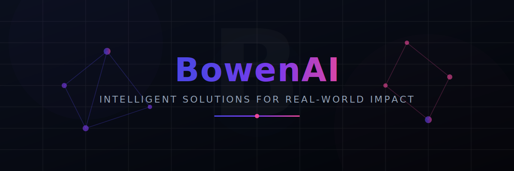

  

  
  

---

### 👋 Welcome to BowenAI

**BowenAI** is an organization dedicated to engineering modern, AI-powered software solutions for real-world impact. We focus on open-source tools, intelligent agent systems, and robust libraries designed for developer productivity and user delight.

---

### 💡 Core Focus Areas

<table width="100%">
  <tr>
    <td width="33%" valign="top">
      <h4>🤖 AI-Driven Innovation</h4>
      
Designing advanced agentic systems, cognitive architectures, and smart automation tools.

    </td>
    <td width="33%" valign="top">
      <h4>🛠️ Developer Experience</h4>
      
Crafting intuitive APIs, well-documented SDKs, and clean, modular open-source codebases.

    </td>
    <td width="33%" valign="top">
      <h4>⚡ Premium Engineering</h4>
      
Prioritizing robust test suites, high performance, and visually stunning user interfaces.

    </td>
  </tr>
</table>

---

### 📂 Public Repositories

Below is a dynamically updated list of our active public repositories.

<!--START-REPO-LIST-->
_The repository list is automatically synchronized here daily. Run the workflow manually to trigger an immediate update._
<!--END-REPO-LIST-->

---

  Stay tuned for new projects, updates, and community contributions! Built with ❤️ by <a href="https://github.com/BowenAI">BowenAI</a>

